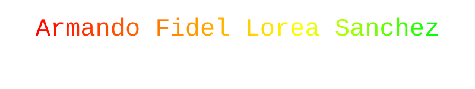

  <!-- Título animado RGB -->
  

  <!-- Logos SVG personalizados -->
  
    
  
  

    

  <!-- Simulación de tu perfil de guns.lol -->
  <h3>🎵 Playlist</h3>
  
   
  
   
  
   
  

    

  <!-- Tech Stack Completo -->
  <h3>💻 Tech Stack</h3>
  
  
<b>Frontend:</b>

  

    
    
    
    
  

  
<b>Backend & Software:</b>

  

    
  

  
<b>Herramientas:</b>

  

    
    
    
  

    
  
  
Hecho con ❤️ y mucho café desde México para el mundo

  
sisaloreas@centrotlalocan.edu.mx

