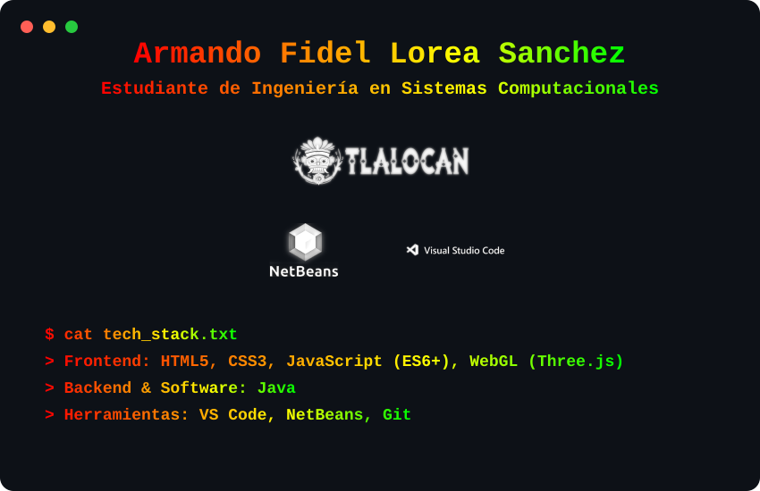
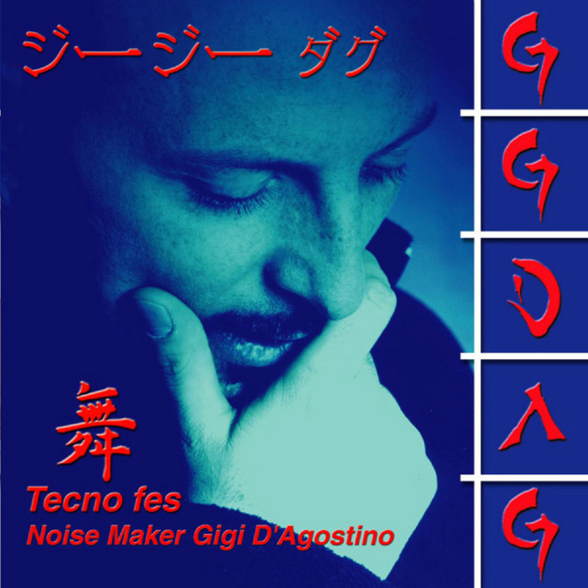
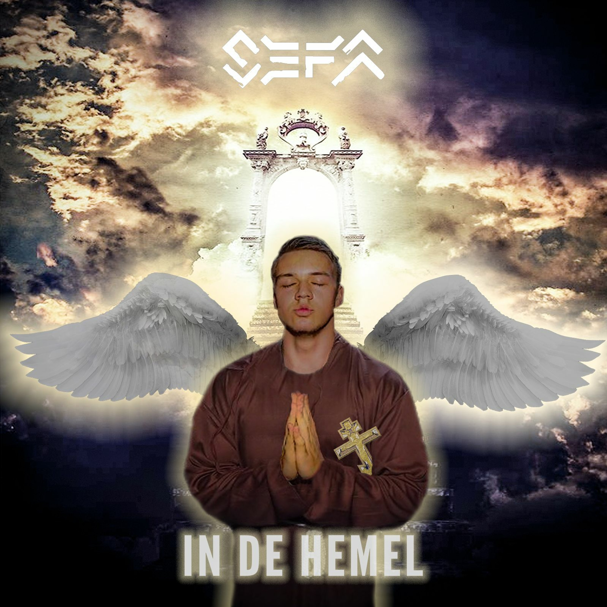
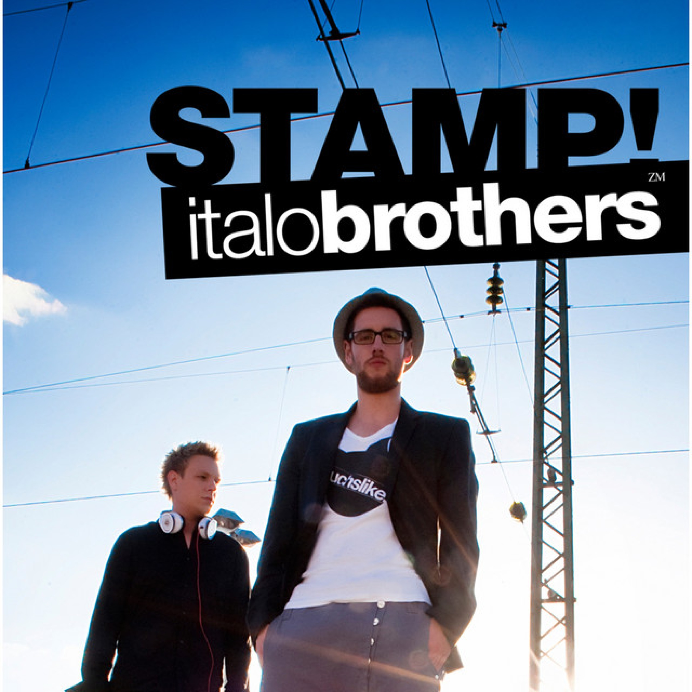

  <!-- El cerebro de Python: Terminal, Logos y Texto Rainbow -->
  

    

  <!-- Playlist interactiva (Links reales) -->
  <h3>🎵 Playlist</h3>
  
  
    
  
  
    
  
  
    
  
  

     

  
Hecho con ❤️ y mucho café desde México para el mundo

  
sisaloreas@centrotlalocan.edu.mx

